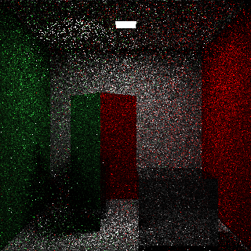
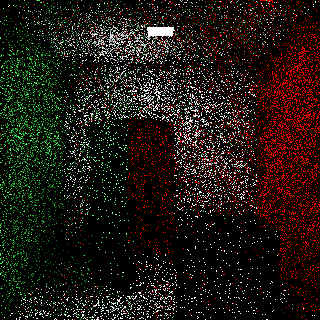
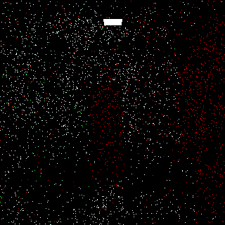
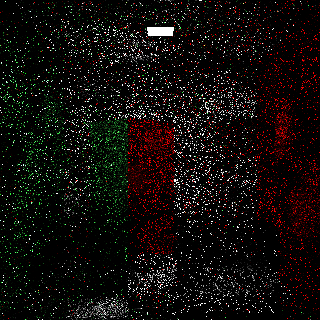
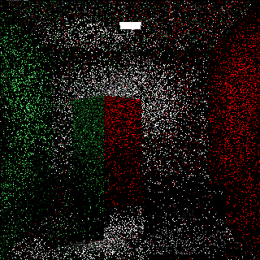
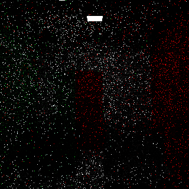
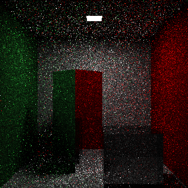

----
#### Writing began 07/11/2025
#### Finalized 10/11/2025

Markov chains in ray tracing can be very useful for importance sampling! 

Shortenings I will use:

Markov Chain Mixture Models for Real-Time Direct Illumination (first paper) -> MCMM  
Real-Time Markov Chain Path Guiding for Global Illumination and Single Scattering (second paper) -> MCPG  
von Mises-Fisher -> vMF  
samples per pixel -> spp  
probability density function -> pdf

I also use 'training' the Markov chains and 'updating' the Markov chains interchangably.

A little while ago (some time in May), I found a paper called [MCMM](https://doi.org/10.1111/cgf.14881).
I was also writing a [ray tracer](https://github.com/Vecvec/phosph_rs) (or path tracer, what
separates one from the other is blurry) and I wanted to have user provided intersectable objects. This
made ReSTIR DI difficult to implement (at the time I thought it was impossible). Therefore, I began implementing MCMM,
and when [MCPG (the sucessor)](https://doi.org/10.1145/3728296) came out I implemented that too. This
is a collection of things I learnt and tried while implemting these.

### The vMF distribution

As part of the Markov chains, both papers uses the [vMF distribution](https://en.wikipedia.org/wiki/Von_Mises%E2%80%93Fisher_distribution).
It's fairly similar to a normal distribution, in that it has a parameter (which is called κ (kappa)
instead of σ (sigma)) and that selects how likely a sample is to be close to the mean. However, it
is on a sphere (or any other n-dimensional hyper-sphere) which means that the vMF distribution can
be used as a pdf. I also made a [graph for this distribution](https://www.desmos.com/3d/4mc6na5f0y)
because I like messing around with this kind of thing.

### Why this vs ReSTIR?

This was largely highlighted in the first paper, however I think it is worth mentioning here too.
It doesn't replace ReSTIR, and can be used together with it for some good results (I never implemented
DI, but my ReSTIR GI works very well with this). However, I also think that this is far
simpler to understand, as I spent more than twice as long just implementing ReSTIR GI (and I still
have only the basic version, and am still not sure it's correct).

### My adventures

When implementing the first paper, while trying to figure out the pseudo code, I found that there was
a field (`S.¯l` [I can't get the name closer in markdown]) accessed by the pseudo code that was neither listed
nor used by any other 'procedure'. I assumed that this was actually the mean cosine (`S.¯r`) however, I
couldn't get this to work (probably just as likely my fault though). Luckily, I noticed that the follow
up (MCPG) paper had come out, and I implemented that one's version of each of the algorithms instead
which worked.

I then went on to implement the second paper. The biggest difficulty in this was the radiance cache. There
are grid based radiance caches such as [GI 1.0](https://doi.org/10.48550/arXiv.2310.19855), but it uses
cache block to cache block updates (from what I could tell), whereas what is ideal when we are already
processing many rays is to use those rays to update the cache. For anyone interested, this is what I
used as my grid radiance cache to load and store:
````wgsl
// From https://github.com/Vecvec/phosph_rs/blob/682e42f4211e9b42da2ad8d4444001fc1f936539/src/bindings.wesl#L33-L40
struct WorldMarcovChainState {
    secondary_hash: atomic<u32>,
    num_samples: atomic<u32>,
    luminance: array<atomic<u32>, 3>,
    lock: atomic<u32>, 
    chain: AtomicMarcovChainState,
    timeout: u32,
}

// From https://github.com/Vecvec/phosph_rs/blob/682e42f4211e9b42da2ad8d4444001fc1f936539/src/path_tracing/general.wesl#L244-L307
fn grid_load_radiance_estimate(pos: vec3<f32>, normal: vec3<f32>, incoming: vec3<f32>) -> vec3<f32> {
    let grid_pos = vec3<i32>(pos / GRID_SIZE);
    let hash = primary_hasher(grid_pos, normal, incoming);
    let idx = hash % arrayLength(&world_Markov_chains);
    var num_samples = atomicLoad(&world_Markov_chains[idx].num_samples);
    var float_radiance = vec3<f32>(bitcast<f32>(atomicLoad(&world_Markov_chains[idx].luminance[0])), bitcast<f32>(atomicLoad(&world_Markov_chains[idx].luminance[1])), bitcast<f32>(atomicLoad(&world_Markov_chains[idx].luminance[2])));
    let secondary_hash = atomicLoad(&world_Markov_chains[idx].secondary_hash);
    if (secondary_hash != secondary_hasher(grid_pos, normal, incoming)) {
        if (atomicLoad(&old_world_Markov_chains[idx].secondary_hash) == secondary_hasher(grid_pos, normal, incoming)) {
            num_samples = atomicLoad(&old_world_Markov_chains[idx].num_samples);
            float_radiance = vec3<f32>(bitcast<f32>(atomicLoad(&old_world_Markov_chains[idx].luminance[0])), bitcast<f32>(atomicLoad(&old_world_Markov_chains[idx].luminance[1])), bitcast<f32>(atomicLoad(&old_world_Markov_chains[idx].luminance[2])));
        } else {
            return vec3(0.0);
        }
    } else {
        world_Markov_chains[idx].timeout = CACHE_TIMEOUT;
    }
    if (num_samples == 0) {
        return vec3(0.0);
    }
    let radiance = float_radiance / f32(num_samples);
    let clamped_radiance = clamp(radiance, vec3(0.0), vec3(1000.0));
    return clamped_radiance;
}

fn grid_add_radiance(pos:vec3<f32>, normal:vec3<f32>, incoming: vec3<f32>, radiance: vec3<f32>) {
    let grid_pos = vec3<i32>(pos / GRID_SIZE);
    let hash = primary_hasher(grid_pos, normal, incoming);
    let idx = hash % arrayLength(&world_Markov_chains);
    let secondary_hash = secondary_hasher(grid_pos, normal, incoming);
    let clamped_radiance = clamp(radiance, vec3(0.0), vec3(100.0));
    if (atomicLoad(&world_Markov_chains[idx].secondary_hash) != secondary_hash) {
        if !(atomicCompareExchangeWeak(&world_Markov_chains[idx].secondary_hash, INVALID_KEY, secondary_hash).exchanged) {
            return;
        }
    }
    let locked = atomicExchange(&world_Markov_chains[idx].lock, STATE_LOCKED);
    // We must make forward progress even if this is locked, so we just return.
    if locked == STATE_LOCKED {
        return;
    }
    let num_samples = atomicLoad(&world_Markov_chains[idx].num_samples);
    if (num_samples >= MAX_NUM_SAMPLES) {
        atomicStore(&world_Markov_chains[idx].lock, STATE_UNLOCKED);
        world_Markov_chains[idx].timeout = CACHE_TIMEOUT;
        return;
    }
    atomicAdd(&world_Markov_chains[idx].num_samples, 1);
    let radiance_red = strip_NaN(clamped_radiance.x + bitcast<f32>(atomicLoad(&world_Markov_chains[idx].luminance[0])));
    atomicStore(&world_Markov_chains[idx].luminance[0], bitcast<u32>(max(radiance_red, 0.0)));
    let radiance_green = strip_NaN(clamped_radiance.y + bitcast<f32>(atomicLoad(&world_Markov_chains[idx].luminance[1])));
    atomicStore(&world_Markov_chains[idx].luminance[1], bitcast<u32>(max(radiance_green, 0.0)));
    let radiance_blue = strip_NaN(clamped_radiance.z + bitcast<f32>(atomicLoad(&world_Markov_chains[idx].luminance[2])));
    atomicStore(&world_Markov_chains[idx].luminance[2], bitcast<u32>(max(radiance_blue, 0.0)));
    atomicStore(&world_Markov_chains[idx].lock, STATE_UNLOCKED);
    world_Markov_chains[idx].timeout = CACHE_TIMEOUT;
}
````
I had to work around a lack of atomic floats in wgsl, but I did not want a full locking system (and wgsl
atomics are always relaxed, so you can't really have a proper lock). Therefore, I have a write-only lock, which
keeps out most of the threads, and then atomics to both prevent write-read data races and the small number
of write-write data races too. Unfortunately this also means writes can (and, from the numbers of total
samples per cache block, I suspect do) get discarded.

The actual Markov chain storage is also done with atomics, but not synchronised. MCPG seemed to recommend
fully unsynchronised writing, but I didn't want to debug a NaN poisoning and discover it came from a data
corruption, so I do each load or store of the Markov chains atomically.

### Modifications

My radiance cache didn't quite cut it though, it failed to properly capture specular reflections (the `incoming`
`vec3<f32>` ~~failed to fix this~~ works ok with bugs fixed, but still isn't quite accurate enough) so I kept
my radiance and other update information (I had quite a bit of it before for ReSTIR) around until the end of
the sample and added an extra update for the first hit. In the future I might try out some other radiance cache
model (or experiment with cache LODs) and see if it works better.

I also tried adding a confidence value to the update, which I set to 1.0 for the end of sample update and
0.25 for the radiance cache update. I haven't seen an improvement from this, but I also haven't seen it
get any worse, so I've left it in my current version to test when I get more complex scenes.

### Improvements

All these images were taken at 8 spp.

Here is the base image (taken on the second frame, but there isn't anything that changes in later frames)


Its fairly difficult to tell that the left wall is green. The right wall is pure red (1.0, 0.0, 0.0), so
it always appears red.

You might just be able to see the two cubes. The tall one is perfectly reflective, and the short one refracts
light.

Here is the same image (on the second frame still) but with the Markov chains


If anyone is curious, on the first frame, only a very small improvement can be seen (but noticable none the less).


You can hopefully see the scene layout now, and maybe even light reflecting onto the ceiling off the tall box.

Once everything has had a time to train (27 frames), this is the result.



I think it gets fairly close to this by the third frame, and by 10 frames I can't see any
further improvement.

As can be seen, the image is dramatically improved. I'm going to provide a colapsable image of what my
implementation of ReSTIR GI looks like when applied to the base (no Markov chain version). Bear in mind that
I'm not sure my ReSTIR GI version is properly implemented and that my version doesn't (yet) support reflective
materials (I need to delay reconnection), hence why I believe that Markov chains are so important.

<details>
  <summary>Possibly incorrect ReSTIR w/o Markov chains, second frame</summary>
  

  (analysis assumes ReSTIR is correct) This is the biased one, so the light reflecting off the tall block is
  blurred. Additionally, biased ReSTIR is typically less noisy so this is probably best case lack of noise.
  I think that the Markov chains are probably as good, possibly better than this.
</details>
<p>
<p>
Notably, I have not gotten as good results from just the world space Markov chains (I've checked and it isn't
my confidence system, it seems to just be a high amount of GI). For small lights and a lot of light coming in
from everywhere they tend to improve noise less then the screen space chains only as can be seen below

 < first frame (just world space Markov chains)

 < second frame (just world space Markov chains)

 < 58th frame (just world space Markov chains)

The issue with the screen space Markov chains is that they tend to generate annoying fireflies (likely due to
having a very small pdf on the indirect light which is still quite bright) that are very noticable on high spps.
They also tend to be slower to train, as not many samples hit the light on the first bounce and after that
training is slowed. The world space Markov chains improve both of these as well as the light reflecting on the box.

 < second frame (just screen space Markov chains)

 < 43rd frame (just screen space Markov chains) (Note that the light reflecting of the box is hard to see)

 < 43rd frame everything divided by 5 to show fireflies.

On the 43rd frame, renderdoc says that the brightest pixel was at 133.58257 (this is probably the light source), and
this is what the image looks like when that is set as the white point.

 < 43rd frame, everything divided by ~133 to show fireflies.

As you can see there are some very bright fireflies!

With just 4 world space samples this is prevented (maybe because they have a wider sample area?).

My final configuration was this: 4 screen space Markov chains from the current subgroup, 12 screen space Markov
chains from last frame, randomly from a 91x91 area around my pixel, and 4 world space Markov chains.

Hopefully you liked the tales from my adventures in Markov chains. It didn't go quite as smoothly as I hoped,
and I've cut out some dumb mistakes I made while implementing this (such as trying to debug why my radiance
cache was constantly getting brighter only to find that when I set my BRDF for reflected materials I had set
the cached version to 10.0 and 1.0 for my PDF causing every bounce off a reflective material causing that
radiance sample to get 10x brighter. I'm unsure if I deliberately set this for testing or something). Also, there
could still be stuff wrong with my path tracer (hopefully not too much though). I want to experiment with more
optimal settings when I get more complex scenes in my path tracer.

Note: the reason I'm using the second frame is because without a bunch of work, renderdoc refuses to capture the
first frame.
